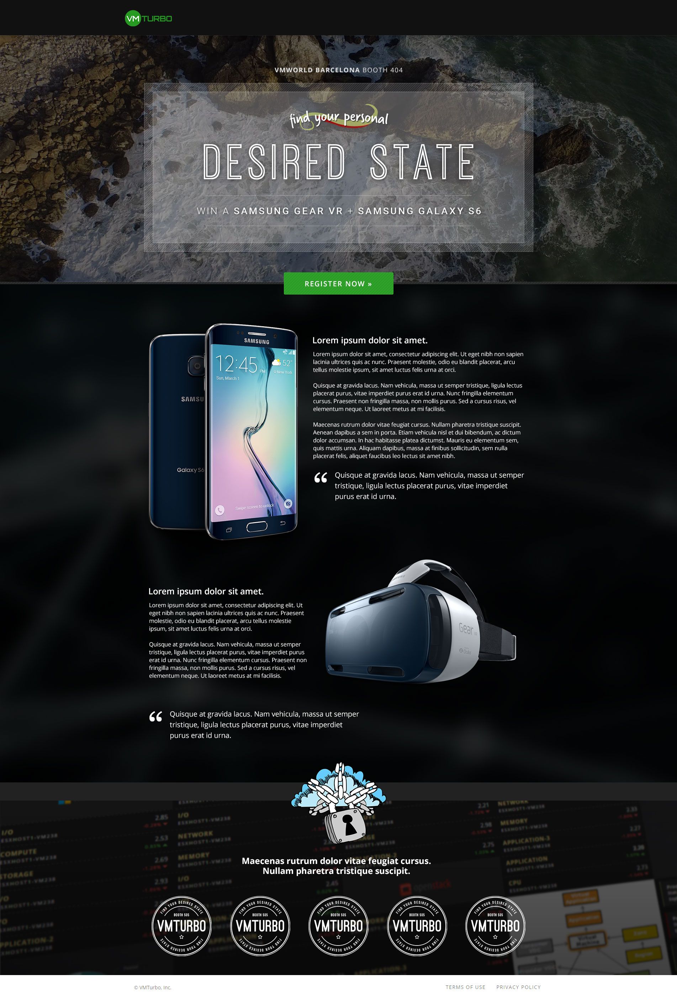

# VMTurbo Front-End Exercise

Link to hosted page:  http://aemassa.github.io/vm-frontend-exercise

## Technologies Used
- HTML
- CSS
- Bootstrap

## Notes

The objective of this exercise was to replicate the sample page shown in frontend-exercise.jpg.  I used HTML, CSS, and Bootstrap to achieve this.  Things to be improved include media queries and responsive design for medium/smaller screens.
